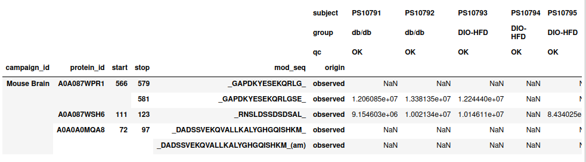

.. _readme:

###############################
PPV - Predicted Peptide Variant
###############################

.. image:: https://zenodo.org/badge/281096200.svg
   :target: https://zenodo.org/badge/latestdoi/281096200

* A Peptide Feature Extraction tool for Mass Spectrometry Data
* A Logistic Classifier, learning the features of uniprot annotated peptides.

------------
Installation 
------------

**Package Install:** 

.. code-block:: bash

    pip install git+ssh://git@github.com/jancr/ppv.git#egg=ppv

**Developer Install:** 

Clone the PPV repository:

.. code-block:: bash

    mkdir ppv-project
    cd ppv-project
    git clone https://github.com/jancr/ppv.git

Install the package

.. code-block:: bash

    cd ppv
    pip install -e .

**Download Data:**

data from the paper can be found at :code:`https://github.com/jancr/ppv-data`

Lets go back to the :code:`ppv-project` folder and clone this repo

.. code-block:: bash

    cd ..
    git clone https://github.com/jancr/ppv-data

Then unzip all the files

.. code-block:: bash

    cd ppv-data/models
    gunzip *.gz
    cd ../features
    gunzip mouse_features_paper.pickle.gz
    cd ../..

Hopefully your :code:`ppv-project` directory now looks like this:

.. code-block:: bash

    $ ls -lh
    drwxrwxr-x 6 jcr jcr 4.0K Mar  3 15:15 ppv
    drwxrwxr-x 6 jcr jcr 4.0K Mar  3 15:21 ppv-data

----------
File Types
----------

There are two core file types in this project

**UPF files:** In the :code:`ppv-data/upf` there are two types of files. The `*.upf:code:`
file which contains 1 line per peptide per sample. It had 3 important concepts:

* **Meta Data**: The field :code:`accno` is the sample id to link it to meta
  data such as "This is Mouse 5"
* **Peptide ID**: the fields :code:`prot_acc`, :code:`pep_start`,
  :code:`pep_stop` and :code:`pep_mod_seq` amounts to the peptide ID, the
  :code:`pep_mod_seq` allows us to have seperate ID's for peptides with
  different PTMs
* **Abundance**: the field :code:`intensity` is the abundance recorded by the
  Mass Spectrometer.

**Sample Meta files:** These files contain meta data about the upf file, this
is necessary for defining groups when doing statistical analysis of the data,
in relation to the PPV algorithm the only field that matters is :code:`rs_acc`
which is used to link to the :code:`accno` field in the upf file, and
:code:`subject` which is the mouse id.

If you want to use the algorithm for your own data you have to convert the
output from the MS into this format.

----------------
Extract features
----------------

There are two use cases for this project

1. use our model to make predictions for your own data
2. train your own model on your (and our?) data

In either case you need to extract features from your data. Before you can train or predict, so
let's do that

All the features can be found in
:code:`ppv-data/features/mouse_features_paper.pickle.gz`, this file contains
all the features extracted from all the tissue files. In order to understand
how this file was created let's create it for 1 tissue, doing it for all simply
amounts to using a for loop :)

**************************************************
Example: create feature data frame for Mouse Brain
**************************************************

Import statements:

.. code-block:: python

    import pandas as pd
    import peputils
    from peputils.proteome import fasta_to_protein_hash
    import ppv

Then we link to the files in :code:`ppv-data`:

.. code-block:: python

    upf_file = 'upf/mouse_brain_combined.upf'
    meta_file = 'upf/mouse_brain_combined.sample.meta'
    campaign_name = "Mouse Brain"
    mouse_fasta = "uniprot/10090_uniprot.fasta"
    known_file = "uniprot/known.tsv"

Then we now create a upf data frame, we do this using data frame method
:code:`.peptidomics.load_upf_meta`, which is defined in :code:`peputils`:

.. code-block:: python

    df_raw = pd.DataFrame.peptidomics.load_upf_meta(upf_file, meta_file, campaign_name)

We then normalize this dataframe such that all the peptides found across all
samples sum to the same, to correct for different sample loading.

.. code-block:: python

    df = df_raw.peptidomics.normalize()

Now we have a normalized peptidomics dataframe, it looks like this:

.. code-block:: python

    df.head()

So much like the :code:`.upf` file we have 1 row for each observed peptide and 1 column
for each sample abundance.

**Very important:** if you use your own data, then you have to rescale it to
follow the same abundance ditribution as our data before feature extraction!,
this can be done either by preprocessing the data as follows:

.. code-block:: python

    df = df.ppv_feature_extractor.rescale_data()

The above dataframe is what is needed for feature extraction, to extract
features from the df use the following method:

.. code-block:: python

    n_cpu = 8
    mouse_proteins = fasta_to_protein_hash(mouse_fasta)

    dataset_features_all = df.ppv_feature_extractor.create_feature_df(
        mouse_proteins, n_cpus=n_cpu, known=known_file, peptides='valid')
    dataset_features = dataset_features_all.ppv.observed

**Note 1:** The feature extraction code is parallelized such that if
:code:`n_cpu=8`, then it will concurrently extract features from 8 protein backbones,
as some proteins have a much higher number of peptides than others (and the
algorithm scales O(N^2) with the number of peptides in a protein), the progress
bar seem to stall, when there are only the 1-5 proteins with most peptides
left. Be patient my young padowan, the program is not stuck in an infinite
loop, but it may take some hours to finish.

**Note 2:** The pipeline was originally made to predict assembled peptides by
predicting all combination of start/stop within a 'peptide cluser', unless you
also want 'assembled' peptide predictions, you can filter them away by using
the :code:`.ppv.observed` property

----------------
Loading features
----------------

The features from the paper can be loaded from the :code:`ppv-data` repository:

.. code-block:: python

    dataset_features = pd.read_pickle('features/mouse_features_paper.pickle')

--------------------------------
Using the Model for Prediction
--------------------------------

See section 4 of the next section

#######################
Training your own model 
#######################

-------------------------------------------------
1. Splitting the data for nested cross-validation
-------------------------------------------------

The code assumes that the feature generation pipeline was run successfully,
transforming the peptidomics data into a pandas dataframe stored as
:code:`mouse_features_paper.pickle`. To split the data into 5 folds, run

.. code-block:: bash
    python scripts/make_crossvalidation_split.py \
        ../ppv-data/features/mouse_features_paper.pickle \
        ../ppv-data/features/mouse_features_paper_sklearn.pickle
    python scripts/make_crossvalidation_split.py --use_all \
        ../ppv-data/features/mouse_features_paper.pickle \
        ../ppv-data/features/mouse_features_paper_assembly_sklearn.pickle

-------------------------
2. Training the ppv model
-------------------------

The script :code:`nested_cv.py` trains our ML models in nested cross-validation,
yielding 20 models. The script also trains various baseline ML models.
Internally, the PPV model presented in the main papers is called
:code:`f_logreg` (frequentist logistic regression). If you want to skip
training baseline ML models, comment out the respective models in :code:`runs`
starting from line 381. 
.. code-block:: bash
    python3 scripts/nested_cv.py -d ../ppv-data/features/mouse_features_paper_sklearn.pickle -od ../ppv-data/nested_cv
This creates a directory called `nested_cv` that contains the cross-validated models.

-------------
3. Evaluation 
-------------

The jupyter notebook :code:`notebooks/manuscript_figures.ipynb` produces the
performance plots shown in the manuscript from :code:`nested_cv` and the saved
:code:`mouse_features_paper_sklearn.pickle` feature data.

the notebooks are saved in markdown format, to convert them to interactive notebook run:

.. code-block:: bash

   python -m jupytext --to notebook notebooks/manuscript_figures.ipynb
   python -m jupytext --to notebook notebooks/plot_validation.ipynb

-------------------------
4. Making new predictions
-------------------------

The full PPV model is an ensemble of the cross-validated models. They can be
found here `here
<https://github.com/jancr/ppv-data/tree/master/nested_cv/cv_f_logreg>`_,
assuming they are downloaded to :code:`nested_cv/cv_f_logreg` you can make
predictions as follows:

.. code-block:: python

   # may throw version warnings because the ppv-data was created using sklearn 1.0.2
   prediction = ppv.predict(dataset_features, "nested_cv/cv_f_logreg")
   dataset_features["Annotations", "PPV"] = prediction

